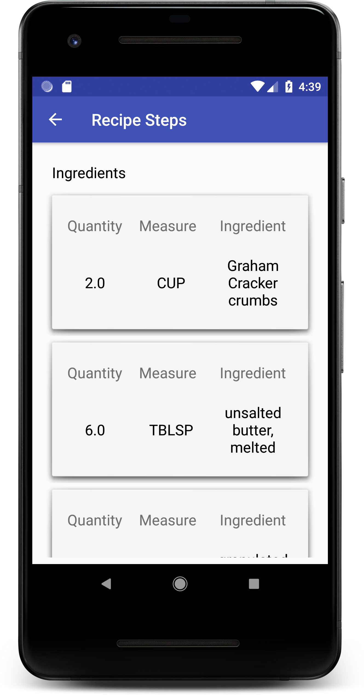

# BakingApp
Baking App is an Android application that allows users to pick particular recipe and see all the ingredients and instruction steps with videos. The application has a widget to display the ingredients. 

The application supports both phones and tablets with multi-pane layout. UI Test using Espresso.

# Phone

# Tablet

# Libraries Used
Android Architecture Components, OkHttp, ExoPlayer, Espresso.
